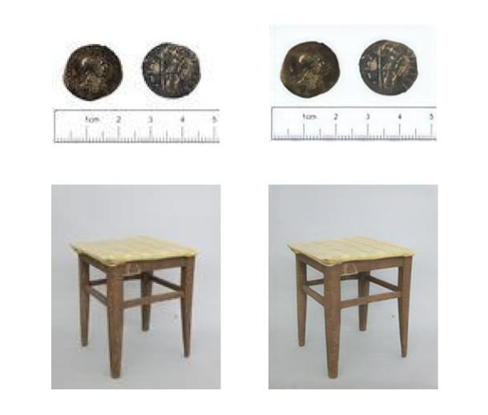

# Enhancing low-resolution images - C4Education

Some of the digitized objects in Cultural Heritage have low resolution images. This can harm the user experience and risk the reusability of these objects in academia and education. 

This repository contains two deployment options for a resolution-enhancement model based on this [open-source project](https://github.com/idealo/image-super-resolution). 

The deployment options are:
* [Command Line Interface](cli/README.md)
* [API](model-api/README.md)

A [Colab notebook demo](https://colab.research.google.com/drive/1xUp4nTDClM4lFRlvZ7vQ6wL8KAm2hBg2?usp=sharing) is also available
